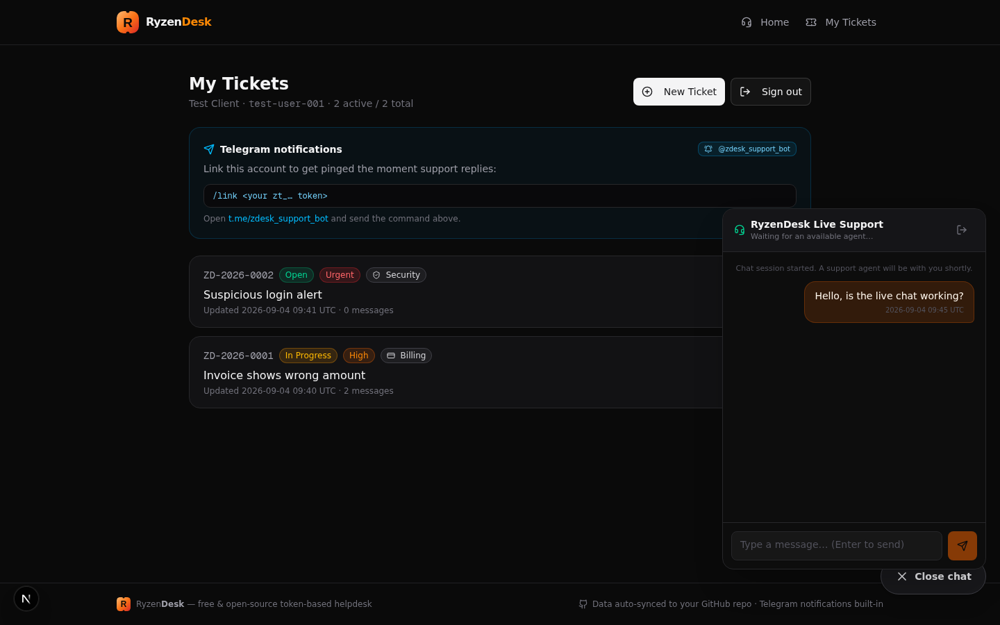

<div align="center">


# RyzenDesk

**The free & open-source, token-based helpdesk your customers actually enjoy using.**

Tickets · Live Chat · Escalations · Telegram Bot · GitHub-Synced Storage · Super-Admin CRM

[](LICENSE)
[](https://nextjs.org)
[](https://www.typescriptlang.org)
[](CONTRIBUTING.md)
[](https://github.com/romangalaxys10-spec/RyzenDesk/releases)

[Features](#-features) · [Quick Start](#-quick-start) · [Screenshots](#-screenshots) · [Configuration](#%EF%B8%8F-configuration) · [FAQ](#-faq) · [Contributing](#-contributing)

</div>

---

**RyzenDesk** is a complete, self-hosted customer support platform built on Next.js 16. Customers submit tickets and get back a **secret access token** — no passwords, no email verification loops. Your team gets a full staff console with assignment, escalation workflows, internal notes and a real-time live chat console. Super admins manage staff accounts, client CRM records and system settings from a built-in admin panel. Everything is stored in a single JSON database that **auto-commits itself to your own GitHub repository** after every change.

Use it as the support desk for your SaaS, freelance clients, e-commerce shop, open-source project or internal IT team. One Docker command and you're live.

## ✨ Features

### 🎫 Ticketing that just works
- **Token-based authentication** — customers sign back in with their User ID + a secret `zt_…` token. Nothing to remember, nothing to leak.
- **Structured submissions** — contact details, 6 issue categories (Billing / Service / Technical / Pre-sale / Abuse / Security), subject, description and how-to-reproduce steps.
- **Auto routing** — every ticket gets an automatic priority and team based on its category (Security → urgent + Security team, and so on).
- **Smart ticket IDs** — human-friendly IDs like `RD-2026-0042`, prefix configurable via `TICKET_PREFIX`.

### 🛠️ Real helpdesk management
- **Assignment** — assign any ticket to any staff member, or send it to unassigned.
- **Escalations** — one click re-routes a ticket to another team/member, bumps priority, logs an escalation history trail and pings the target on Telegram.
- **Statuses & priorities** — Open → In Progress → Waiting on Customer → Resolved → Closed, with low / medium / high / urgent priorities.
- **Internal notes** — staff-only replies customers never see, right next to public replies.
- **Live queues** — 7 live stat cards, full-text search and status / type / assignee filters.

### 💬 Live chat (with ON/OFF switch)
- Floating chat widget for signed-in customers — start, chat, end.
- Staff chat console with **waiting / active / ended** queues and one-click claim.
- **Super admins can toggle live chat ON/OFF** instantly from the console.

### 🛡️ Super-admin CRM & user management
- **Pre-created bootstrap super-admin** (`admin`) walks you through initial setup on first login — you set your own password before doing anything else.
- **Staff management** — create / rename / suspend / delete agents, promote to super admin, change teams, reset passwords (one-time display, forced change on next login).
- **Client CRM** — full customer directory with ticket stats, editable contact info + private notes, secret-token resets, Telegram unlinking and cascading deletes.
- **Audit log** — the last 120 admin actions, always visible.
- **Self-healing** — if every super admin is ever removed, the bootstrap admin is safely re-created (locked behind password setup) so you can never lock yourself out.

### 🤖 Telegram bot built in
- Instant notifications: new tickets, replies, status changes, escalations — to staff and customers.
- Two-way commands: `/link <token>` for customers, `/staff <password>` for team members, `/tickets`, `/unlink`, `/id`.
- Zero infrastructure — the bot long-polls, no webhook or public URL needed.

### 🗄️ GitHub-persisted database (zero infrastructure)
- The whole database is one JSON file, **auto-committed to your private GitHub repo** after every mutation (debounced ~2s, conflict-safe with SHA-based recovery and retry backoff).
- The app pulls the latest state from GitHub on boot — restart anywhere, deploy anywhere, never lose a ticket.
- No Postgres, no Redis, no Docker volumes required (though a volume works great too).

## 📸 Screenshots

| | |
|---|---|
|  |  |
| *Branded landing page & token-based submission* | *Staff console with live stats & queues* |
|  |  |
| *Super-admin CRM: staff accounts & client users* | *Ticket thread with internal notes & escalation* |
|  |  |
| *Built-in live chat widget* | *First-login setup for the bootstrap admin* |

## 🚀 Quick Start

### Option A — Docker (recommended)

```bash
git clone https://github.com/romangalaxys10-spec/RyzenDesk.git
cd RyzenDesk
cp .env.example .env        # edit at least SESSION_SECRET
docker compose up -d
```

Open **http://localhost:3000** — done.

### Option B — Node / Bun

```bash
git clone https://github.com/romangalaxys10-spec/RyzenDesk.git
cd RyzenDesk
bun install                 # or: npm install
cp .env.example .env        # edit at least SESSION_SECRET
bun run dev                 # or: npm run dev
```

Open **http://localhost:3000**.

### 🔑 First login (initial setup)

1. Go to **Sign in → Staff** tab.
2. Sign in with the pre-created super admin:

   | Username | Password |
   |----------|----------|
   | `admin` | `RyzenAdmin@2026` |

3. **You'll immediately be required to set your own password** before you can access anything. This is the whole setup — after that, invite your team from **Admin → Staff accounts**.

> ⚠️ **Security note:** always change the bootstrap password on first login (RyzenDesk enforces it), and set a strong `SESSION_SECRET` in your `.env`.

## ⚙️ Configuration

All configuration lives in `.env` — copy `.env.example` and adjust:

| Variable | Required | Default | Description |
|----------|----------|---------|-------------|
| `SESSION_SECRET` | **Yes (prod)** | dev fallback | HMAC secret for signing sessions & hashing staff passwords. Set a long random string. |
| `SUPERADMIN_USERNAME` | No | `admin` | Username of the pre-created bootstrap super admin. |
| `SUPERADMIN_PASSWORD` | No | `RyzenAdmin@2026` | Initial bootstrap password (forced to change on first login). |
| `SUPERADMIN_USERNAMES` | No | first seeded staff | Comma-separated staff usernames to create as super admins when seeding via `STAFF_PASSWORDS`. |
| `STAFF_PASSWORDS` | No | — | JSON map to seed extra staff, e.g. `{"Roman":"pass1","Alice":"pass2"}`. Only adds missing accounts. |
| `TICKET_PREFIX` | No | `RD` | Prefix for ticket IDs (`RD-2026-0001`). |
| `GITHUB_TOKEN` | No | — | GitHub PAT enabling the auto-synced database. Without it, RyzenDesk runs on the local file only. |
| `GITHUB_REPO` | No | — | `owner/repo` where the JSON database is persisted (private repo recommended). |
| `GITHUB_BRANCH` | No | `main` | Branch used for database sync. |
| `GITHUB_DB_PATH` | No | `data/helpdesk-db.json` | File path inside the repo for the database. |
| `TELEGRAM_BOT_TOKEN` | No | — | Token from [@BotFather](https://t.me/BotFather) enabling notifications + the support bot. |
| `NEXT_PUBLIC_SITE_URL` | No | `http://localhost:3000` | Public URL, used for SEO metadata. |

### 🤖 Enabling the Telegram bot

1. Create a bot with [@BotFather](https://t.me/BotFather) → copy the token into `TELEGRAM_BOT_TOKEN`.
2. Restart RyzenDesk. The bot long-polls automatically — no webhook/public URL needed.
3. Staff: send `/staff <your staff password>` to the bot to receive ticket alerts.
4. Customers: send `/link <their zt_… token>` to get reply notifications.

### 🗄️ Enabling GitHub database sync

1. Create a **private** GitHub repository (e.g. `my-helpdesk-db`).
2. Create a fine-grained PAT with **Contents: Read & write** on that repo.
3. Put both into `.env` as `GITHUB_REPO=you/my-helpdesk-db` and `GITHUB_TOKEN=…`.
4. Restart. RyzenDesk pushes the full DB after every change and pulls the newest state on boot. Your ticket history now survives redeploys, migrations and coffee spills.

## 👥 Roles

| Capability | Client | Agent | Super Admin |
|------------|:------:|:-----:|:-----------:|
| Submit tickets, reply, live chat | ✅ | — | — |
| View / reply all tickets, internal notes | — | ✅ | ✅ |
| Assign, escalate, change status/priority | — | ✅ | ✅ |
| Staff accounts (create/edit/suspend/delete) | — | — | ✅ |
| Client CRM (create/edit/delete/reset tokens) | — | — | ✅ |
| Live chat ON/OFF & system settings | — | — | ✅ |
| Audit log | — | — | ✅ |

## 📡 API overview

Everything the UI does is a clean JSON API you can script against:

| Endpoint | Method | Auth | Purpose |
|----------|--------|------|---------|
| `/api/tickets` | POST | public | Submit a ticket → returns ticket ID + secret token |
| `/api/auth/login` | POST | public | Client (`mode=user`) or staff (`mode=staff`) login |
| `/api/me` | GET | session | Profile + own tickets |
| `/api/tickets/[id]` | GET / PATCH | session / staff | Read ticket · update status/priority/assignee/team |
| `/api/tickets/[id]/messages` | POST | session | Public reply or staff internal note |
| `/api/tickets/[id]/escalate` | POST | staff | Escalate to member/team (auto-notify) |
| `/api/chats` · `/api/chats/[id]` · `…/messages` | POST/GET/PATCH | session | Live-chat lifecycle |
| `/api/staff/tickets` | GET | staff | Full queue with stats |
| `/api/settings` | GET / PATCH | public / super admin | Live chat ON/OFF |
| `/api/admin/staff` · `/api/admin/users` | GET / POST | super admin | Staff & client CRM management |
| `/api/auth/change-password` | POST | staff | Self-service or forced initial-setup password change |
| `/api/system/status` | GET | public | Sync + bot health |

## ❓ FAQ

**Is RyzenDesk really free?**
Yes — MIT licensed. Use it for client projects, your company, or resell hosted instances. No license keys, no telemetry.

**Do I need a database server?**
No. RyzenDesk stores everything in a single JSON file that syncs to your GitHub repo. SQLite-level simplicity, Git-backed durability.

**How do customers log back in?**
With their **User ID + the secret token** shown once when they created their first ticket. If they lose it, a super admin can reset the token from the CRM in one click.

**Can I white-label it?**
Absolutely — the name, logo (`public/logo.svg`), ticket prefix and colors are all yours to change. Fork it and make it your brand.

**Does live chat need extra services?**
No. It's built in — poll-based, works behind any reverse proxy, and can be switched OFF by a super admin at any time.

**What happens if I delete all super admins?**
RyzenDesk re-creates the bootstrap `admin` account automatically (password setup enforced), so you can never be permanently locked out.

## 🗺️ Roadmap

- [ ] Email notifications (SMTP) alongside Telegram
- [ ] Canned replies & SLA timers
- [ ] Multi-language UI (i18n)
- [ ] File attachments on tickets
- [ ] Webhook / Zapier events

## 🤝 Contributing

Contributions are welcome! Read [CONTRIBUTING.md](CONTRIBUTING.md) to get started — bug reports, feature ideas, docs improvements and code PRs are all appreciated. Please follow the [Code of Conduct](CODE_OF_CONDUCT.md).

## 📄 License

[RyzenDesk](https://github.com/romangalaxys10-spec/RyzenDesk) is released under the [MIT License](LICENSE) — free for personal and commercial use.

<div align="center">

**If RyzenDesk saved you a weekend of work, consider giving the repo a ⭐ — it genuinely helps.**

</div>
