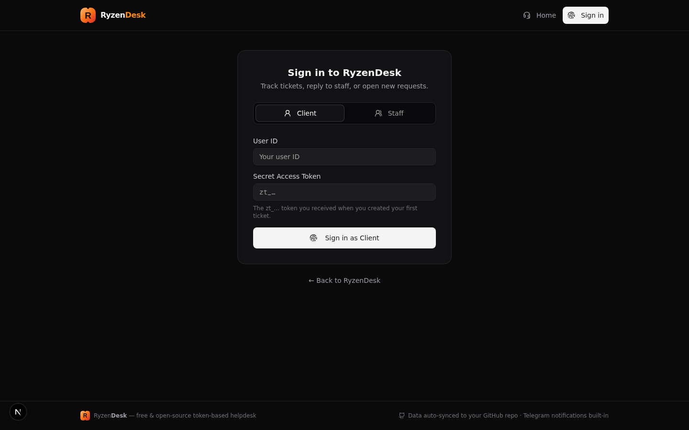
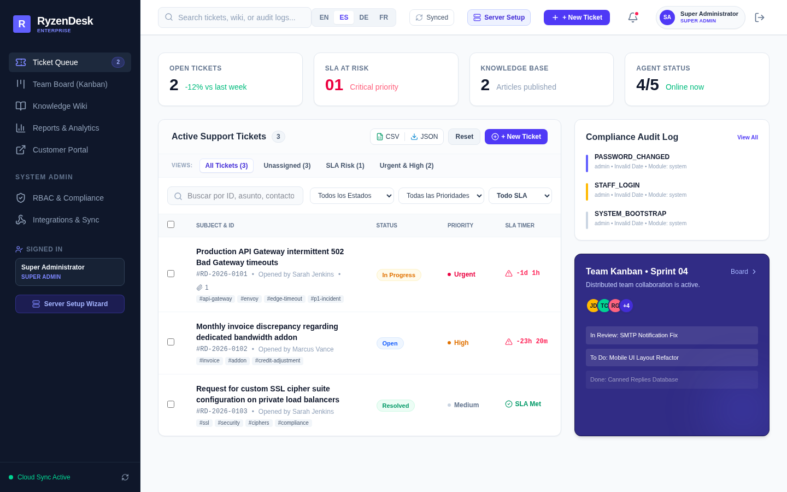
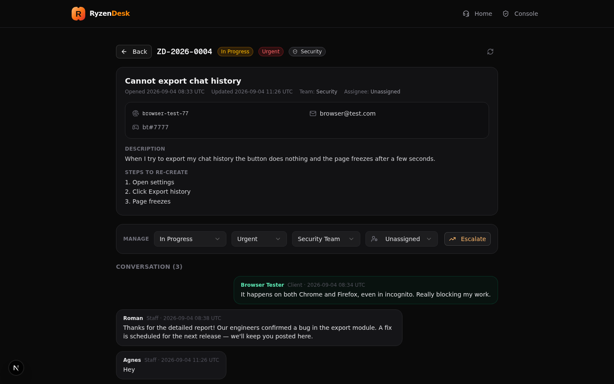
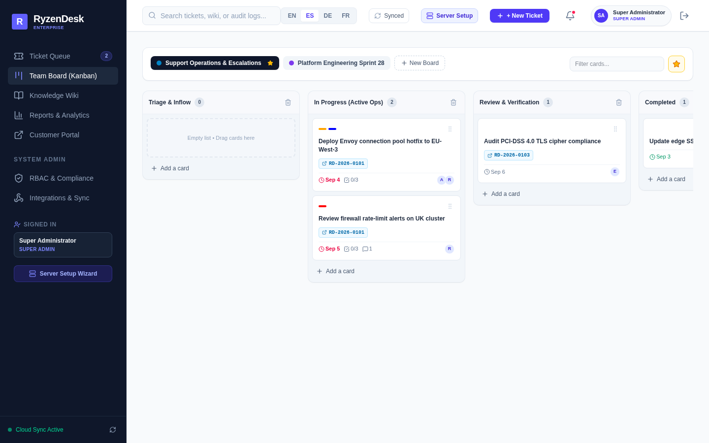
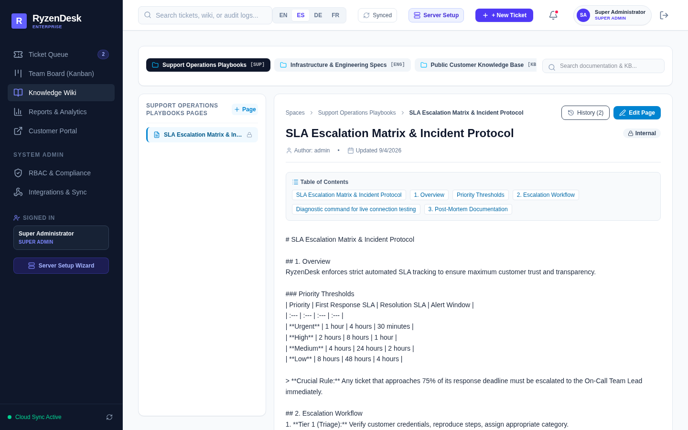
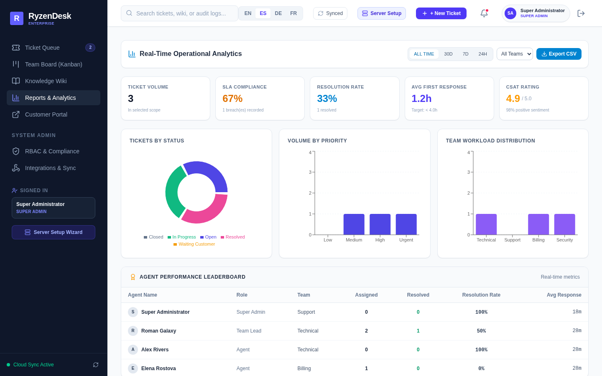
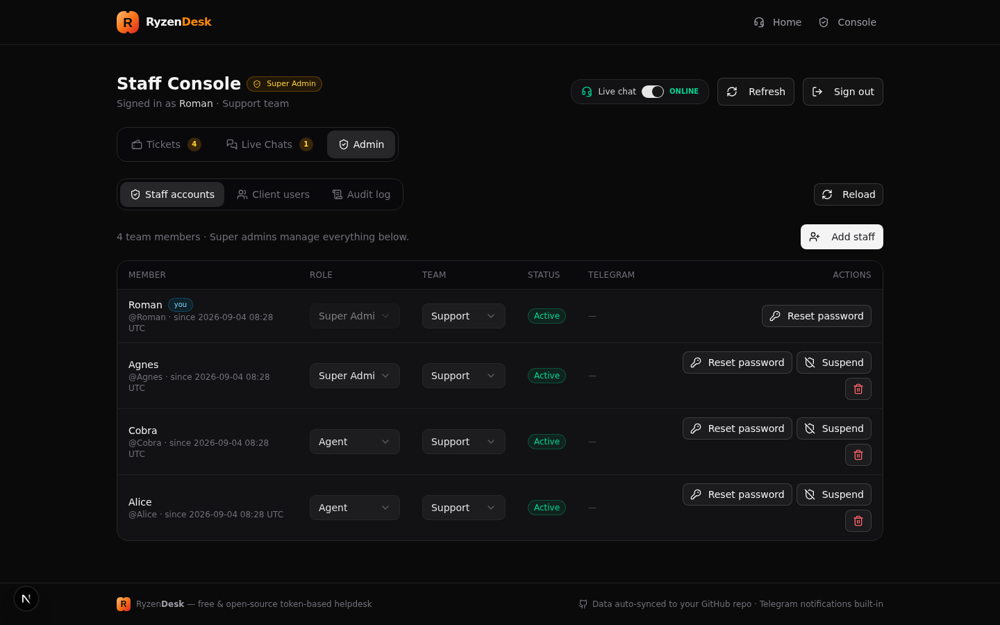
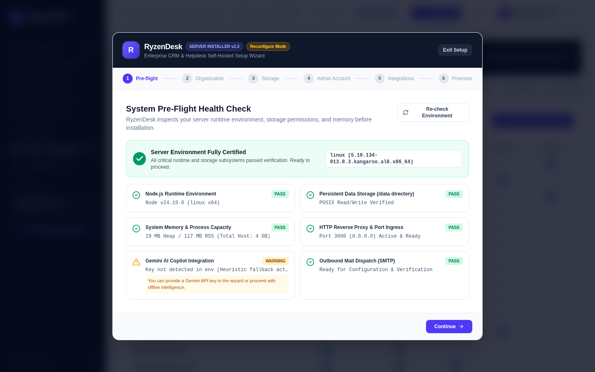
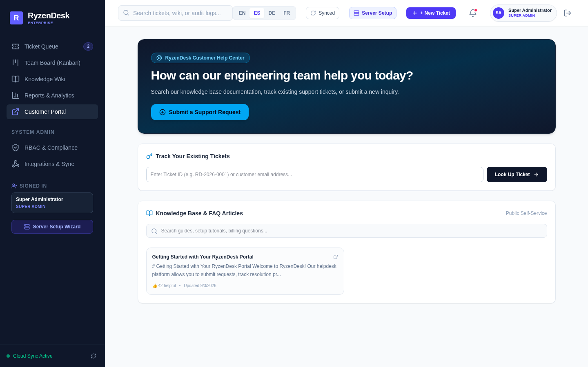
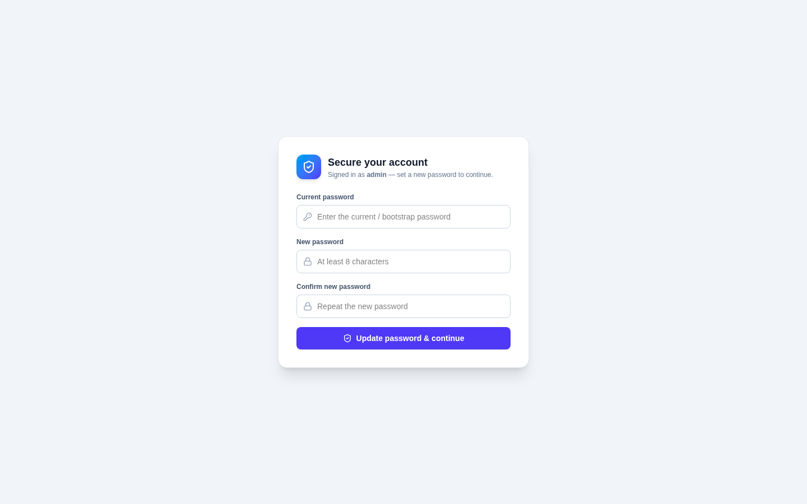

<div align="center">

# 🚀 RyzenDesk

**The Modern, Open-Source, Token-Based Customer Support & Helpdesk Platform**

*Crafted with React 19, TypeScript, Express, Tailwind CSS, Recharts, and Git-backed persistence — secured with session auth, server-enforced RBAC, and AES-256 encrypted cloud sync.*

[](LICENSE)
[](https://www.typescriptlang.org/)
[](https://react.dev/)
[](https://tailwindcss.com/)
[](Dockerfile)
[](#-security-model)
[](CONTRIBUTING.md)

[Features](#-key-features--productivity-suite) • [Screenshots](#-screenshots) • [Security](#-security-model) • [Quick Start](#-quick-start) • [Architecture](#-documentation-hub) • [REST API](#-api-reference) • [Docs Hub](#-documentation-hub)

</div>

---

## 📖 Overview

**RyzenDesk** is a self-hostable, zero-database-overhead helpdesk platform designed for development teams, modern SaaS companies, and freelance consultants who need a responsive ticketing system without paying hundreds of dollars per seat for Zendesk or Jira Service Management.

Built around **token-based passwordless customer authentication**, customers submit and track tickets seamlessly using a unique secret token (`zt_...`), while agents and administrators leverage a **deep slate & indigo executive console** equipped with SLA breach prediction timers, Kanban sprint boards, multi-language internationalization (i18n), audit trails, webhook delivery pipelines, Telegram bot alerts, and transactional SMTP email notifications.

**Every API request is authenticated and permission-checked on the server.** The RBAC matrix is not just UI decoration — it is enforced by middleware on all 50+ REST endpoints, staff passwords are scrypt-hashed, sessions use HMAC-signed HttpOnly cookies, webhook targets are SSRF-validated, and the Git-backed database snapshot is encrypted with AES-256-GCM before it ever leaves the server.

### 🌟 Why RyzenDesk?

- 🔒 **Zero-Password Client Experience**: Customers submit tickets and receive an instant secret access token (`zt_...`) — no friction, no lost passwords. Tokens are stored as irreversible SHA-256 digests.
- 🛡️ **Server-Enforced RBAC**: The 5-tier permission matrix is enforced by auth middleware on every endpoint — not just hidden in the UI.
- ⏱️ **Real-Time SLA Engine**: Live countdown timers with dynamic color-coding (`Safe`, `Warning`, `Breached`) calculated against granular priority policies.
- 📋 **Kanban & Sprint Management**: Drag-and-drop workflow columns with priority chips, assignee avatars, and sprint velocity tracking.
- 📚 **Integrated Knowledge Wiki**: Multi-category markdown article authoring with helpfulness voting, revision history, and instant keyword filtering.
- 📊 **Executive Analytics Suite**: Real-time resolution metrics, category distributions, priority breakdowns, and agent leaderboards rendered via Recharts.
- 🌐 **Global i18n Localization**: Instant client-side switching between **English (EN)**, **Spanish (ES)**, **German (DE)**, and **French (FR)**.
- 🧙 **Self-Hosted Web Installation Wizard**: 6-step friendly web-based setup wizard guiding server administrators through pre-flight diagnostics, branding, storage engines, master admin security, and live service testing.
- 🗄️ **Zero-Database Git Persistence**: State automatically persists to a single conflict-safe JSON store — **AES-256-GCM encrypted** — that syncs directly with private GitHub repositories.
- ⚡ **1-Click Full Codebase Deployer**: Automated deployment scripts push codebase updates directly to GitHub with secret masking.

---

## 📸 Screenshots

| Secure Sign-In & Bootstrap Rotation | Staff Executive Console & SLA Timers |
|:---:|:---:|
|  |  |
| *Session login + forced first-login password rotation* | *Real-time queue management, audit trail & SLA counters* |

| Interactive Ticket Thread & AI Copilot | First-Class Kanban Sprint Boards |
|:---:|:---:|
|  |  |
| *SLA compliance timers, escalation & Gemini AI assistant* | *Drag-and-drop boards linked to tickets* |

| Knowledge Wiki with Revisions | Executive Analytics Suite |
|:---:|:---:|
|  |  |
| *Spaces, revisions & internal/public visibility* | *Recharts dashboards & agent leaderboards* |

| Granular RBAC Matrix (Server-Enforced) | 6-Step Installation Wizard |
|:---:|:---:|
|  |  |
| *Permissions enforced by API middleware on every route* | *Pre-flight diagnostics before provisioning* |

| Customer Self-Service Portal | Server Setup & Reconfiguration |
|:---:|:---:|
|  |  |
| *Token tracking, knowledge deflection & ticket submission* | *Cryptographic bootstrap lock & recovery receipt* |

---

## 🛡️ Security Model

RyzenDesk treats security as a feature, not an afterthought. The full hardening specification lives in [`docs/SECURITY.md`](docs/SECURITY.md); the highlights:

| Control | Implementation |
|:---|:---|
| **Authentication** | Session-based staff login + token-based customer login. HMAC-signed, HttpOnly, SameSite=Lax cookies; 24h sliding expiry; server-side session store (never synced to Git). |
| **Password storage** | Node built-in **scrypt** with per-user salt; constant-time verification; mandatory rotation of bootstrap/admin-provisioned passwords. |
| **Authorization** | **Every** `/api` route passes through `requireAuth` / `requirePermission(...)` middleware driven by the live RBAC matrix in the database. Clients are hard-scoped to their own tickets; internal notes are stripped from client responses. |
| **Customer tokens** | `zt_...` tokens are generated from `crypto.randomBytes` (192-bit entropy) and stored **only as SHA-256 digests** — shown once at creation and emailed to the customer. |
| **Webhooks (SSRF)** | Target URLs validated at creation **and** at every delivery: http/https only, no credentials, no redirects, DNS resolved and checked against loopback/private/link-local ranges (incl. cloud metadata `169.254.169.254`). |
| **Cloud sync** | Database snapshots are encrypted with **AES-256-GCM** (key derived from `SESSION_SECRET`/`ENCRYPTION_KEY`) before being pushed to GitHub. Production refuses to push with default secrets. Legacy cleartext snapshots are transparently migrated on pull. |
| **At-rest secrets** | SMTP password, Telegram bot token and the installation lock key are AES-256-GCM encrypted inside the JSON store; customer tokens are hashed. |
| **Rate limiting** | Sliding-window limits on login, customer login, ticket creation, offline batch, install execution, and all API traffic. |
| **CSRF & headers** | SameSite cookies + Origin validation on mutations; `X-Content-Type-Options`, `X-Frame-Options: DENY`, `Referrer-Policy`, `Permissions-Policy`, COOP, HSTS (over TLS) and a production CSP. |
| **Sessions & install guard** | Logout invalidates server-side state; tampered cookies rejected. Installation wizard endpoints are public **only** during the first-run bootstrap window and require Super Admin afterwards. |
| **Audit trail** | Security-relevant events (logins, password changes, staff/RBAC/SMTP/webhook changes, deployments, sync) are recorded with actor, role and source IP, exportable as CSV. |

---

## ⚡ Key Features & Productivity Suite

### 📬 Omnichannel Intake & Automation (v2.5)
- **Email-to-Ticket Piping**: provider-agnostic inbound webhook (SendGrid Inbound Parse, Mailgun Routes, Postmark, or a local fetchmail script). Replies containing a ticket id (`RD-YYYY-NNNN`) are appended to the existing thread (sender-verified); anything else opens a new ticket tagged `via-email`. Shared secret auth (`X-Inbound-Secret`) stored AES-256-GCM encrypted at rest.
- **Automation Rules Engine**: no-code rules (`subject/body/email/type/priority` × `contains/equals/starts_with`, match *all/any*) with allowlisted actions (`set_priority`, `set_team`, `set_type`, `add_tag`, `assign`). Run on every new ticket — web *and* emailed — with run counters and audit entries.
- **AI Triage** (optional, Gemini): auto-classifies type/priority/team on arrival, strictly filling only default gaps so rules and customer choices always win; audited and tagged `ai-triaged`.
- **Auto-QA Suggestion Engine**: keyword-scored matching over the public Knowledge Base while the customer types (rate-limited), plus an optional Gemini "quick tip" when no article matches — deflecting tickets before they're submitted.

### 💬 Live Chat & Customer Context
- **Live Chat**: portal visitors (anonymous name+email or logged-in clients) start threads via a floating widget; staff answer from the chat endpoints — REST polling, unguessable capability-token thread ids, toggled by `liveChatEnabled`.
- **Customer Context Panel**: one glance shows the contact's full ticket history, open/resolved counts, average CSAT and portal-account info right inside the ticket view (Kayako *SingleView* parity).

### 📣 Portal Content Suite
- **Announcements**: published posts surfaced on the customer portal.
- **Network Status**: per-component health (`operational / degraded / outage / maintenance`) with an aggregate overall status at `GET /api/status-page`.
- **Downloads Area**: curated, publishable file links for customers.
- All managed under **Admin ▸ Content & Automation** via the new `admin_content` RBAC permission (super_admin + team_lead by default).

### 🧠 Pluggable AI Providers — NVIDIA NIM + Custom (v2.6)
- **NVIDIA NIM first-class**: paste a free `nvapi-…` key, hit **Scan Models** — RyzenDesk ranks the free NIM catalog by speed heuristics, latency-probes the top candidates in parallel, and auto-selects the fastest working model.
- **Custom providers**: any OpenAI-compatible API (self-hosted vLLM/ollama, OpenRouter, Groq, …).
- **One AI gateway for everything**: AI triage, ticket summarization, response generation and the self-help quick-tip all use the active provider first, falling back to Gemini and then to built-in heuristics — never vendor-locked.
- **Key safety**: provider keys are AES-256-GCM encrypted at rest and never leave the server.

### 🤖 AI Copilot & Automated Intelligence (Powered by Gemini)
- **One-Click Ticket Summarization**: Condenses extensive multi-message customer threads into actionable bullets, root cause diagnostics, and recommended next actions.
- **Smart Response Generator**: Generates 3 contextual response options (e.g. detailed step-by-step diagnostic, quick acknowledgement, or gentle follow-up) inserted directly into the editor.
- **Customer Sentiment Analysis**: Automatic sentiment scoring identifying urgent or frustrated clients with distinct visual badges.
- **Graceful Heuristic Fallback**: Zero external dependency failures — includes built-in semantic fallback algorithms if AI credentials are unset.

### ⚡ Supercharged Agent Productivity
- **Global Command Palette (`Cmd+K` / `Ctrl+K`)**: Rapid keyboard-first navigation across tickets, knowledge wiki pages, quick actions, and tab routing.
- **Agent Collision Detection & Live Presence**: Real-time heartbeat tracker alerting agents when teammates are viewing or typing in the same ticket, preventing duplicate work.
- **Batch Ticket Operations**: Multi-select support tickets to perform instant bulk status changes, mass reassignments, priority escalations, or bulk deletions.
- **Time Tracking & Billable Hours**: Interactive stopwatch with live elapsed counter and manual duration logging with billable/non-billable categorization.
- **Rich Markdown Composer**: Complete formatting toolbar (bold, italics, code blocks, blockquotes, ordered lists, markdown tables) with a real-time Write/Preview toggle.
- **Quick Views & Tag Filtering**: Dedicated instant filters for *Unassigned*, *SLA Risk*, and *Urgent & High* queues with clickable `#tag` badges.
- **Export to CSV & JSON**: One-click streaming exports of ticket records and metrics for audits and data pipelines.

### 🎯 Customer Experience & Self-Service
- **Self-Service Knowledge Deflection**: Intelligently searches and recommends relevant Knowledge Base articles as the customer types their ticket subject, deflecting routine inquiries before submission.
- **Customer Satisfaction (CSAT) Survey**: Automated 5-star feedback rating and qualitative review widget displayed upon ticket resolution.
- **Audio Feedback System**: High-fidelity, synthetic Web Audio API chimes for incoming messages and status alerts without requiring external media assets.
- **Global System Toast Notifications**: Accessible, self-dismissing feedback notifications for operational updates.

### 🧙 Self-Hosted Server Installation Wizard
- **6-Step Guided Web Setup**: Browser-driven installation flow akin to modern CRM and enterprise self-hosted platforms (WordPress/Ghost/Nextcloud).
- **Automated Pre-Flight Environmental Audits**: Validates Node.js version, `/data` read/write permissions, RAM RSS/Heap memory footprint, and network ports in real time.
- **Organization & Branding Setup**: Custom helpdesk naming, primary support email, public base URL, default system language, and timezone settings.
- **Dual Storage Strategy**: Choose between the zero-dependency **RyzenDesk Atomic ACID JSON Engine** (single conflict-free file) or **Cloud Git Mirror** with automated snapshotting.
- **Master Admin Security**: Guided creation of the primary super-administrator account with live entropy password validation.
- **Live Communication Gateway Testers**: Interactive SMTP mail server and Gemini AI token testers validating external API connectivity before finalizing installation.
- **Cryptographic Lock & Disaster Recovery**: Generates a tamper-proof installation lock key (`rd_lock_...`) and downloadable recovery manifest.
- **Dedicated Admin Reconfiguration Tab**: Allows administrators to review server parameters, re-run diagnostics, or reconfigure server profile without editing raw JSON files.

### 🎫 Core Ticket Management & Collaboration
- **Ticket Linking & Duplicate Merging**: Link related issues (`relates_to`, `blocked_by`, `subtask_of`) or merge duplicates with automated conversation thread consolidation.
- **Draggable Kanban Board**: HTML5 drag-and-drop workflow cards across custom board columns with team member avatars.
- **6 Standard Categories**: Technical Issue, Billing, Feature Request, Account Access, Bug Report, and General Inquiry.
- **Priority Matrix**: `Low`, `Medium`, `High`, and `Urgent` with auto-routing to designated functional teams.
- **Internal Notes**: Collaborate privately within ticket threads without alerting external clients — **never** exposed through client-authenticated API responses.
- **File Attachments**: Drag-and-drop file attachment support with thumbnail previews and size validation.
- **Canned Responses**: Quick insert pre-configured response macros via keyboard shortcuts or dropdown.

### ⏱️ SLA Policies & Compliance
- Configure custom response and resolution target times per priority level (Urgent: 1h / 4h, High: 2h / 8h, etc.).
- Active countdown timer chips that turn yellow when approaching limits and pulsing red upon SLA breaches.
- Complete exportable compliance audit logs recording timestamps, actors, and state transitions.

### 🛡️ Role-Based Access Control (RBAC)
- 5 distinct user privilege tiers, **enforced server-side on every endpoint** (see [RBAC Matrix](docs/RBAC_MATRIX.md)):
  - **Super Admin**: Full platform configuration, API keys, staff management, RBAC matrix, and system deployment.
  - **Support Manager (Team Lead)**: Team queues, SLA policy tuning, webhook dispatchers, and analytics export.
  - **Senior/Support Agent**: Queue processing, customer replies, status updates, and private note authoring.
  - **Viewer**: Read-only operational visibility.
  - **Customer / Client**: Own-ticket submission, thread tracking, and knowledge base lookups.

### 🔌 Real-Time Integrations
- **Telegram Bot**: Full bi-directional notifications via [@BotFather](https://t.me/BotFather) with `/link <token>` and `/staff` commands.
- **SMTP Email Notifications**: Automated customer receipts and agent assignment alerts with TLS/STARTTLS support (credentials encrypted at rest).
- **Outgoing Webhooks**: HMAC SHA-256 signed event dispatching for `ticket.created`, `ticket.updated`, and `ticket.resolved` with SSRF target validation.
- **GitHub Cloud Sync**: Auto-commits AES-256-GCM encrypted database snapshots to private repositories with conflict-safe SHA resolution.

---

## 🚀 Quick Start

### Option 1: Docker (Fastest)

```bash
# 1. Clone the repository
git clone https://github.com/romangalaxys10-spec/RyzenDesk.git
cd RyzenDesk

# 2. Copy environment variables & set a strong SESSION_SECRET
cp .env.example .env

# 3. Launch with Docker Compose
docker compose up -d
```

Access the application at **`http://localhost:3000`**.

> The container runs as a non-root user, stores persistent state in the `ryzendesk-data` volume, and exposes a healthcheck on the public `/api/health` endpoint.

---

### Option 2: Local Node.js / NPM

```bash
# 1. Clone repository & install dependencies
git clone https://github.com/romangalaxys10-spec/RyzenDesk.git
cd RyzenDesk
npm install

# 2. Configure environment (set SESSION_SECRET!)
cp .env.example .env

# 3. Start development server
npm run dev
```

Visit **`http://localhost:3000`** in your browser.

---

## 🔑 Initial Admin Setup & Credentials

RyzenDesk boots with a pre-configured, bootstrap Super Admin account. On first login, the platform **strictly enforces** an initial password change before granting access to administrative controls.

| Role | Default Username | Default Password | Setup Requirement |
|:---|:---|:---|:---|
| **Super Admin** | `admin` | `RyzenAdmin@2026` | **Mandatory password update on initial login** |

The sign-in flow:

1. Open the console — you are greeted by the **session login screen** (staff or customer tabs).
2. Sign in with the bootstrap credentials — the platform immediately forces a **password rotation** before any administrative API is reachable.
3. Optionally run the **Server Setup Wizard** (sidebar) to provision organization branding, storage engine, SMTP and integrations.

> ⚠️ **Production Security Notice**: Always change the default bootstrap password and set a cryptographically random `SESSION_SECRET` in your `.env` before public deployment. Production instances **refuse to push cloud-sync snapshots** until a real secret is configured.

---

## ⚙️ Environment Configuration

Configuration is managed via `.env`. A complete template is provided in [`.env.example`](.env.example):

| Variable | Required | Default | Description |
|:---|:---:|:---|:---|
| `SESSION_SECRET` | **Yes (prod)** | `dev-fallback` | HMAC secret for session cookies, at-rest secret encryption and cloud-sync envelope encryption. **Required in production.** |
| `ENCRYPTION_KEY` | No | falls back to `SESSION_SECRET` | Dedicated key for AES-256-GCM cloud-sync + at-rest secret encryption. |
| `PORT` | No | `3000` | Server listening port |
| `SUPERADMIN_USERNAME` | No | `admin` | Initial bootstrap administrator username |
| `SUPERADMIN_PASSWORD` | No | `RyzenAdmin@2026` | Initial bootstrap password (rotation enforced on first login) |
| `GITHUB_TOKEN` | No | `—` | GitHub Personal Access Token (PAT) for cloud storage sync |
| `GITHUB_REPO` | No | `romangalaxys10-spec/RyzenDesk` | GitHub repository target (`owner/repo`) |
| `GITHUB_BRANCH` | No | `main` | Branch for cloud database synchronization |
| `GITHUB_DB_PATH` | No | `data/helpdesk-db.json` | Path inside the repository for the encrypted JSON database |
| `TELEGRAM_BOT_TOKEN` | No | `—` | Bot token provided by Telegram [@BotFather](https://t.me/BotFather) |
| `SMTP_HOST` | No | `—` | Outgoing SMTP mail server hostname |
| `SMTP_PORT` | No | `587` | Outgoing SMTP port (587 for TLS, 465 for SSL) |
| `SMTP_USER` | No | `—` | SMTP authentication username / email |
| `SMTP_PASS` | No | `—` | SMTP authentication password / app key |
| `SMTP_FROM` | No | `support@ryzendesk.internal` | Outgoing sender email address |

---

## 🚢 Deployment & GitHub Sync

RyzenDesk includes built-in tools to push all codebase updates directly to GitHub:

### Using the CLI Script
```bash
# Push all code updates using the automated script
npm run deploy

# Push with a custom release message
npm run deploy -- --message="feat: v2.4 production release"

# Or execute the shell script directly
./scripts/deploy.sh
```

### Using the Admin Console UI
1. Navigate to **Admin Console &rarr; Integrations & Sync** tab.
2. Click **Deploy Updates to GitHub**.
3. View the live deployment status and commit hash confirmation in real time.

> 🔐 The JSON **database** that syncs to GitHub is always wrapped in an AES-256-GCM encryption envelope (`ryzendesk-encrypted-db` format). The repository never receives ticket data, customer tokens, password hashes or SMTP credentials in plaintext.

---

## 📡 API Reference

All features are accessible via standard JSON REST endpoints. **Unless marked Public, every endpoint requires a session cookie** (staff or customer) and the corresponding RBAC permission — enforced in `server/auth.ts` middleware.

### Authentication
| Endpoint | Method | Auth | Description |
|:---|:---:|:---:|:---|
| `/api/auth/login` | `POST` | Public (rate-limited) | Staff sign-in; sets signed HttpOnly session cookie |
| `/api/auth/customer-login` | `POST` | Public (rate-limited) | Customer sign-in with email + `zt_...` secret token |
| `/api/auth/me` | `GET` | Session | Current session profile + effective permissions |
| `/api/auth/change-password` | `POST` | Session | Rotate password (enforced on first login) |
| `/api/auth/logout` | `POST` | Session | Destroy session server-side |

### Tickets & Productivity
| Endpoint | Method | Auth | Description |
|:---|:---:|:---:|:---|
| `/api/tickets` | `POST` | Public (rate-limited) | Submit new ticket; returns Ticket ID & one-time secret token |
| `/api/tickets` | `GET` | Staff (`tickets_view_all`) / Client (own scope) | Fetch ticket queue |
| `/api/tickets/:id` | `GET` | Staff or ticket owner | Retrieve complete ticket thread (internal notes stripped for clients) |
| `/api/tickets/:id` | `PATCH` | `tickets_edit_status` (+`tickets_assign`) | Update ticket status, priority, assignee, or team |
| `/api/tickets/:id/messages` | `POST` | `tickets_reply` | Add public reply or private staff note |
| `/api/tickets/:id/escalate` | `POST` | `tickets_escalate` | Escalate ticket to higher tier with alert dispatch |
| `/api/tickets/bulk` | `POST` | `tickets_edit_status` | Bulk status/priority/assignment/tag operations |
| `/api/tickets/:id/timelogs` | `POST` | `tickets_reply` | Log billable time entries |
| `/api/tickets/:id/csat` | `POST` | Ticket owner or staff | Submit CSAT rating |
| `/api/tickets/:id/link` / `merge` | `POST` | `tickets_edit_status` | Link or merge related tickets |
| `/api/tickets/export` | `GET` | `tickets_view_all` | CSV/JSON export |
| `/api/ai/summarize-ticket` | `POST` | `tickets_reply` | Gemini thread summarization (heuristic fallback) |
| `/api/ai/smart-replies` | `POST` | `tickets_reply` | AI-drafted response suggestions |

### Knowledge, Boards & Analytics
| Endpoint | Method | Auth | Description |
|:---|:---:|:---:|:---|
| `/api/wiki/pages` | `GET` | Public (public pages) / Staff (internal) | Knowledge base |
| `/api/wiki/pages` | `POST` / `PUT` | `wiki_create_edit` | Author / update articles (revisioned) |
| `/api/wiki/spaces` | `POST` | `wiki_manage_spaces` | Create wiki spaces |
| `/api/kanban/boards` | `GET` / `POST` | `kanban_view` / `kanban_create_board` | Boards CRUD |
| `/api/kanban/cards` | `POST` / `PATCH` / `DELETE` | `kanban_edit_cards` / `kanban_delete_cards` | Card operations |
| `/api/analytics` | `GET` | `analytics_view` | Executive metrics |
| `/api/canned-replies` | `GET` / `POST` / `PUT` / `DELETE` | Staff / `canned_replies_manage` | Response macros |

### Administration & System
| Endpoint | Method | Auth | Description |
|:---|:---:|:---:|:---|
| `/api/admin/staff` | `GET` / `POST` / `PATCH` | `admin_manage_staff` | Manage staff roster, roles, and status (hashes never leave the server) |
| `/api/admin/rbac` | `GET` / `PUT` | Staff / `admin_manage_rbac` | View or modify the live permission matrix |
| `/api/admin/sla` | `GET` / `PUT` | Staff / `sla_manage` | SLA policy parameters |
| `/api/admin/smtp` | `GET` / `PUT` / `test` | `admin_smtp` | SMTP settings (masked) & test dispatch |
| `/api/admin/webhooks` | `GET` / `POST` / `DELETE` / `test` | `admin_webhooks` | Webhook pipelines (SSRF-validated targets) |
| `/api/admin/audit` | `GET` / `export` | `admin_view_audit` | Compliance audit log |
| `/api/sync/push` / `pull` | `POST` | `admin_cloud_sync` | Encrypted database snapshot sync |
| `/api/admin/deploy-codebase` | `POST` | `admin_deploy` | Trigger full codebase commit and push to GitHub |
| `/api/install/preflight` / `status` | `GET` | Public pre-install / Super Admin after | Installation wizard diagnostics & state |
| `/api/install/execute` / `reset` | `POST` | Public bootstrap window / Super Admin after | Provision or reset the installation |
| `/api/health` | `GET` | Public | Liveness probe |

---

## 📚 Documentation Hub

Deep-dive guides are available in the [`docs/`](docs/) directory:

- 🛡️ **[Security Model](docs/SECURITY.md)**: Hardening controls, threat-model mapping and verification evidence.
- 🏛️ **[System Architecture](docs/ARCHITECTURE.md)**: Architectural diagrams, state machine flows, and storage mechanics.
- 📖 **[REST API Specification](docs/API.md)**: Comprehensive request/response schema documentation.
- 🚀 **[Production Deployment Guide](docs/DEPLOYMENT.md)**: Docker, Cloud Run, VPS, and CI/CD pipelines.
- 🛡️ **[RBAC & Security Matrix](docs/RBAC_MATRIX.md)**: Granular role definitions, capability matrices, and audit logging.
- 🤖 **[Telegram Bot Setup](docs/TELEGRAM_SETUP.md)**: BotFather configuration, webhook handling, and customer linking.
- 📧 **[SMTP Mailer Setup](docs/SMTP_SETUP.md)**: Configuring Gmail, SendGrid, Amazon SES, and Postmark.

---

## 🛠️ Tech Stack

- **Frontend Framework**: [React 19](https://react.dev/) + [Vite 6](https://vitejs.dev/)
- **Styling & Design System**: [Tailwind CSS 4](https://tailwindcss.com/)
- **Icons**: [Lucide React](https://lucide.dev/)
- **Data Visualization**: [Recharts](https://recharts.org/)
- **Animations**: [Motion](https://motion.dev/)
- **Backend Server**: [Express 4](https://expressjs.com/) with native TypeScript execution via [tsx](https://github.com/privatenumber/tsx)
- **Persistence Engine**: Git-backed zero-infrastructure JSON store + GitHub API synchronization (AES-256-GCM encrypted)
- **Cryptography**: Node built-in `crypto` — scrypt password hashing, HMAC-signed sessions, SHA-256 token digests, AES-256-GCM envelopes
- **Containerization**: [Docker](https://www.docker.com/) & Docker Compose (non-root runtime, healthchecked)

---

## 🤝 Contributing

We welcome contributions from the community! Check out [CONTRIBUTING.md](CONTRIBUTING.md) for local development setup, coding standards, and PR guidelines. Please adhere to our [Code of Conduct](CODE_OF_CONDUCT.md).

---

## 📄 License

RyzenDesk is open-source software released under the permissive [MIT License](LICENSE). Free for personal and commercial use without seat limitations.

<div align="center">
  <sub>Built with ❤️ by the RyzenDesk open-source community. If this software helps your team, please consider giving it a ⭐ on GitHub!</sub>
</div>
